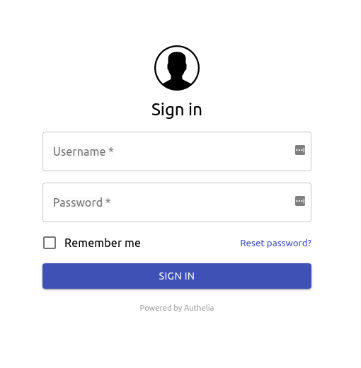

*IMPORTANT: This is currently the only method available as first factor.

Authelia supports several kind of user databases:

* An LDAP server like OpenLDAP or OpenAM.
* An Active Directory.
* A YAML file
