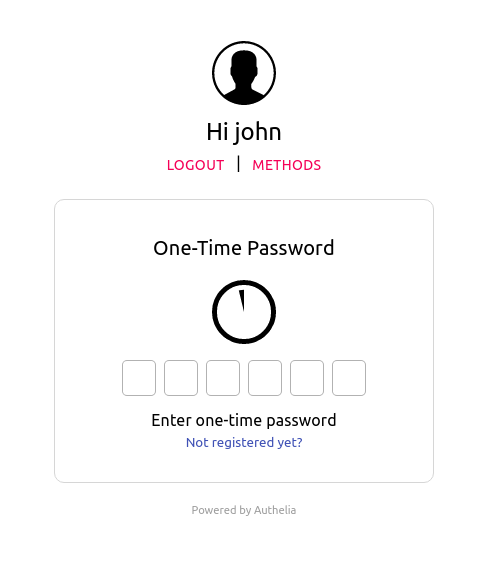
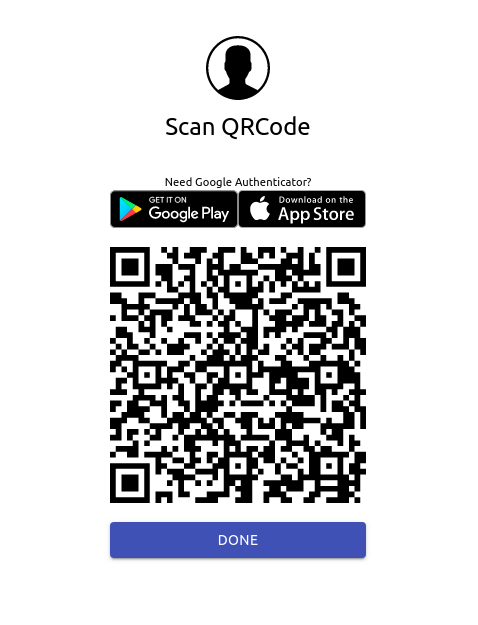
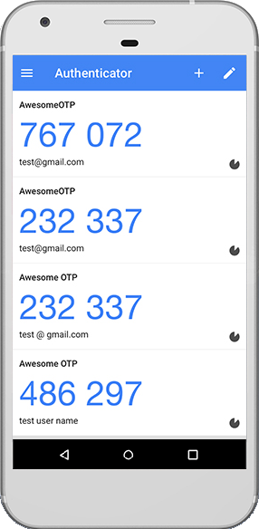

**Authelia** supports time-based one-time password generated by apps like [Google Authenticator].

After having successfully completed the first factor, select **One-Time Password method**
option and click on **Register device** link. This will e-mail you to confirm your identity.

*NOTE: If you're testing **Authelia**, this e-mail has likely been sent to the mailbox available at https://mail.example.com:8080/*

Once this validation step is completed, a QR Code gets displayed.

You can then use [Google Authenticator] or an authenticator of your choice to scan the code in order to register your device.

From now on, you get tokens generated every 30 seconds that
you can use to validate the second factor in **Authelia**.

## Limitations

Users currently can only enroll a single TOTP device in **Authelia**. This is standard practice, as a user can obviously
register a second device with the same QR Code. As there is no tangible benefit and it is harder to keep track of
multiple devices it's not a feature we will implement.

[Google Authenticator]: https://google-authenticator.com/
